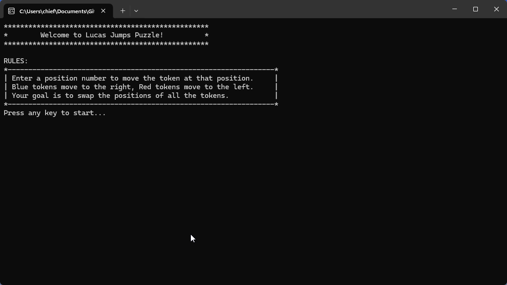

# Lucas Jumps

Lucas Jumps for windows terminal in c++

## Features
    ASCII art,
    Error handling,
    Smooth character movement,
    Collision detection,
    Windows API calls,
    Simple keystroke processing for fluid controls

## How to Run
Using an IDE (e.g., Visual Studio, CLion, Code::Blocks)

    Open the LucasJumps.sln file in your preferred IDE.

    Run the project with debugging enabled.

## Demo Output

